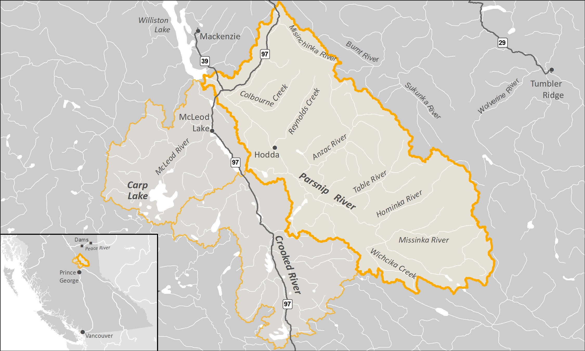

```{r importdata, echo=FALSE}

source('R/packages.R')  ##should clean up this area
source('R/functions.R')

#always_allow_html: true
# test <- pull_data(sheet = try)

```


```{r setup, include = TRUE, echo =FALSE, message=FALSE, warning=FALSE}
# knitr::opts_chunk$set(echo=FALSE, message=FALSE, warning=FALSE, 
#                       fig.align="center", fig.width = 5.118, fig.height = 3.409,
#                       fig.path = ('fig/'))
source('R/packages.R')
source('R/Functions.R')

#establish connection with database 
drv <- dbDriver("PostgreSQL")
conn <- dbConnect(drv, 
                  dbname = 'postgis',
                  host = 'localhost', 
                  port = '5432',
                  user = 'postgres', 
                  password = 'postgres')

knitr::opts_chunk$set(echo=FALSE, comment=NA, message=FALSE, warning=FALSE, connection = "conn",
                      fig.align="center", fig.width = 5.118, fig.height = 3.409)

drake::loadd(tracks)
drake::loadd(c(site_location_data, habitat_data, table_overview_report))

##this is from our title if we want it to autogenerate "Fish Habitat confirmation - PSCIS Crossing `r my_site` - `r pull_data(sheet = loc_data, site = my_site)`"


```


```{r loadpscis}

##filter with a date so that the report is reproducable after we submit our data

##things we want to know are - how many crossings assessed, how many barriers, how many potential barriers and how many fords

#Enter the values for you database connection and connect
#connect and see if the connection to the database is working


# print(dbGetQuery(conn,
#            "SELECT table_name
#            FROM information_schema.tables
#            WHERE table_schema='whse_basemapping'"))


query <- "WITH wsg AS (SELECT * FROM whse_basemapping.fwa_watershed_groups_poly WHERE watershed_group_id IN ('166')) Select p.*, wsg.watershed_group_code FROM whse_fish.pscis_assessment_svw p, wsg WHERE ST_Intersects(p.geom,wsg.geom)"

pscis_historic <-  sf::st_read(conn, query = query)

#make table of results
pscis_historic_summary <-   pscis_historic %>% 
  st_set_geometry(NULL) %>% 
  select(current_barrier_result_code,watershed_group_code) %>%
  filter(watershed_group_code == 'PARS') %>% 
  group_by(current_barrier_result_code)  %>% 
  summarise(count =n()) 
  
  
pscis_historic_references <- pscis_historic %>%
  st_set_geometry(NULL) %>% 
  filter(watershed_group_code == 'PARS') %>% 
  group_by(consultant_name, year = lubridate::year(lubridate::as_date(assessment_date)), ecocat_url)  %>% ##http://a100.gov.bc.ca/pub/acat/public/viewReport.do?reportId=50797 this is the Hooft 2015 report.  the link in pscis is incorrect
  summarise(count =n()) %>% 
  mutate(reference_year = year + 1,
         reference_year = case_when(consultant_name %ilike% 'hooft' ~ year + 2,
                                    TRUE ~ reference_year)) %>% 
         # ecocat_url = case_when(consultant_name %ilike% 'hooft' ~ 'http://a100.gov.bc.ca/pub/acat/public/viewReport.do?reportId=50797',
         #                        TRUE ~  ecocat_url))
  ungroup() %>% 
  mutate(consultant_name = stringr::str_to_title(consultant_name)) 
  # filter(consultant_name != 'REGIONAL MANAGER NORTHERN')  ##the links don't work on these

##get my pcsic working table used to prioritized for hab confirmations
query <- "WITH wsg AS (SELECT * FROM whse_basemapping.fwa_watershed_groups_poly WHERE watershed_group_id IN ('166')) Select p.*, wsg.watershed_group_code FROM working.my_pscis_20190709 p, wsg WHERE ST_Intersects(p.geom,wsg.geom)"

pscis_planning <-  sf::st_read(conn, query = query) %>% 
  select(-fid) ##need to get rid of this to burn to geopackage for some reason

test <- pscis_planning %>%
  filter(!is.na(my_priority)) %>% 
  mutate(my_priority = stringr::str_to_title(my_priority)) %>% 
  filter(my_priority == 'High')
  

##save it to the geopackage for simon
# st_write(pscis_planning,     "./data/pscis_planning.geojson", "pscis_planning")


pscis_planning_summary <- pscis_planning %>% ##lets see if we can replicate our screening variables NOT COMPLETE
  st_set_geometry(NULL) %>%
  filter(!is.na(my_priority)) %>% 
  mutate(my_priority = stringr::str_to_title(my_priority)) %>% 
  group_by(my_priority) %>% 
  summarize(count =n())

##get a summary of fixed crossings
pscis_fixed <-  pscis_planning %>%
  st_set_geometry(NULL) %>%
  filter(my_priority %like% 'fixed')

```

# {.tabset}

```{r}
if(knitr::is_html_output() == TRUE){
knitr::asis_output("## Executive Summary")
  } else knitr::asis_output('**Executive Summary**')  
```


The health and viability of freshwater fish populations depends on access to tributary and off channel areas which provide refuge during high flows, opportunities for foraging as well as overwintering, spawning and summer rearing habitats. In addition, open migration corridors are can facilitate adaptation to the impacts of climate change such as rising water temperatures and changing flow regimes. Culverts can present barriers to fish migration due to increased water velocity, turbulence, a vertical drop at the culvert outlet and/or maintenance issues.  There are hundreds of culverts presenting barriers to fish passage in the Parsnip River watershed with some of these structures obstructing fish movement to valuable fish habitat.

<br>

In the spring and summer of 2019, the Society for Ecosystem Restoration Northern BC (in collaboration with New Graph Environment, Hillcrest Geographics and the McLeod Lake Indian Band) conducted fish habitat confirmation assessments throughout the Parsnip River watershed.  Prior to the field surveys a literature and Provincial Stream Crossing Inventory Summary System (PSCIS) database review was conducted and a community scoping exercise within the McLeod Lake Indian Band was undertaken to focus the work on fish passage restoration candidates with the highest potential benefits for salmonid populations in the watershed. Crossings prioritized for habitat confirmation field assessments were those identified as having potentially high fisheries value as well as likely large quantities of habitat upstream. The project aligns with the Fish and Wildlife Compensation Program Streams Action Plan [@fishandwildlifecompensationprogramPeaceBasinStreams2014] objective of conserving or enhancing high priority species and habitats by implementing actions to both identify restoration opportunities and restore fish passage in streams.

<br>

Review of the PSCIS database indicated that within the Parsnip River watershed, since `r min(pscis_historic_references$year)`, `r length(pscis_historic$id)` assessments for fish passage (Phase 1) have been conducted at crossing structures. Locations of 99 crossing structure assessments were selected for a detailed office review and ranked for follow up based on upstream wetland, lake, and instream habitat quantity, and quality; fish species present, or suspected, near the crossing; stream order, previously recorded channel size and recommendations of past fish passage assessments. 

<br>
 
Habitat confirmation assessments were conducted between August 30, 2019 and September 8, 2019 at 17 crossings ranked as high or moderate priority for follow up. During the habitat confirmations a total of approximately 15 km of stream was assessed with `r table_overview_report %>% filter(Priority %ilike% 'high') %>% nrow() %>% english::as.english()` crossings rated as high priorities for rehabilitation, `r table_overview_report %>% filter(Priority %ilike% 'Moderate') %>% nrow() %>% english::as.english() %>% str_to_title()` crossings rated as moderate priorities and `r table_overview_report %>% filter(Priority %ilike% 'Low') %>% nrow() %>% english::as.english() %>% str_to_title()` crossings rated as low priorities.

<br>

At the time of reporting, communications were underway with Ministry of Forests, Lands, Natural Resource Operations & Rural Development representatives, forest licensees and engineering consultants to commission an engineering site plan and design for a fish passable structure to replace one of the barrier culverts identified as a high priority for replacement. It is expected that funding for the design will be provided through this project. 


```{r}
if(knitr::is_html_output() == TRUE){
knitr::asis_output("## Acknowledgements")
  } else knitr::asis_output('**Acknowledgements**')  
```

The Society For Ecosystem Restoration Northern BC gratefully acknowledges the financial support of the Fish and Wildlife Compensation Program for its contribution to this project. The FWCP is partnership between BC Hydro, the Province of B.C., Fisheries and Oceans Canada, First Nations and public stakeholders to conserve and enhance fish and wildlife in watersheds impacted by BC Hydro dams.

\newpage

## Introduction {.tabset}
The health and viability of freshwater fish populations depends on access to tributary and off channel areas which provide refuge during high flows, opportunities for foraging as well as overwintering, spawning and summer rearing habitats [@swalesRoleOffChannelPonds1989; @Bramblett_2002].  Culverts can present barriers to fish migration due to increased water velocity, turbulence, a vertical drop at the culvert outlet and/or maintenance issues [@tech9_access]. In addition, open migration corridors are essential for adapting to the impacts of climate change such as rising water temperatures and changing flow regimes [@seligerRiverConnectivityHabitat2018]. There are hundreds of culverts presenting barriers to fish passage in the Parsnip River watershed with some of these structures obstructing fish movement to valuable fish habitat [@gollnerPrinceGeorgeTimber2013; @hooftPrinceGeorgeForest]. 

<br>

In the spring and summer of 2019, the Society for Ecosystem Restoration Northern BC (in collaboration with New Graph Environment, Hillcrest Geographics and the McLeod Lake Indian Band) conducted fish habitat confirmation assessments throughout the Parsnip River watershed.  Prior to the field surveys a literature and database review was conducted and a community scoping exercise within the McLeod Lake Indian Band was undertaken to focus the work on fish passage restoration candidates with the highest potential benefits for salmonid populations in the watershed. Crossings prioritized for habitat confirmation field assessments were those identified as having potentially high fisheries value as well as likely large quantities of habitat upstream. Prioritization rankings were assigned based on upstream wetland, lake, and instream habitat quantity, and quality; fish species present, or suspected, near the crossing; stream order, previously recorded channel size and recommendations of past fish passage assessments [@gollnerPrinceGeorgeTimber2013]. 

<br>


```{r, eval = knitr::is_html_output() == FALSE}
knitr::asis_output("Although there currently are no plans for long-term maintenance of the site, the interactive version of this report was made available at https://newgraphenvironment.github.io/Parsnip_Fish_Passage/.") 
```


## Background {.tabset}
As a result of high-level direction from the provincial government of British Columbia, a Fish Passage Strategic Approach protocol has been developed for British Columbia to ensure that the greatest opportunities for restoration of fish passage are pursued.  A Fish Passage Technical Working Group has been formed to coordinate the protocol and data is continuously amalgamated within the Provincial Stream Crossing Inventory System (PSCIS) which has been built to house all culvert related data.  Historically, British Columbia Timber Sales has administered most of the fish passage assessment, design and remediation contracts in the province with the majority of funding typically provided by the Land Based Investment Strategy (LBIS). The strategic approach protocol for fish passage restoration involves a four-phase process as described in [@fptwg_strategic_approach]:

 * Phase 1: Fish Passage Assessment – Fish stream crossings within watersheds with high fish values are assessed to determine barrier status of structures and document a general assessment of adjacent habitat quality and quantity.
 * Phase 2: Habitat Confirmation – Assessments of crossings prioritized for follow up in Phase 1 studies are conducted to confirm quality and quantity of habitat upstream and down as well as to scope for other potential nearby barriers that could affect the practicality of remediation.
 * Phase 3: Design – Site plans and designs are drawn for priority crossings where high value fish habitat has been confirmed. 
 * Phase 4: Remediation – Implementation of re-connection of isolated habitats through replacement, rehabilitation or removal of prioritized crossing structure barriers. 

<br>

The scope of this project included planning and implementation for Phase 2 of the strategic approach protocol in the Parsnip River watershed.  The Parsnip River watershed was chosen for habitat confirmation actions due to its high fisheries values, because it is a watershed impacted by dam operations and because there has been significant investment in Phase 1 assessments since 2001 with 574 assessments for fish passage already completed. 

<br>


```{r loadwatershedinfo}
watershed_raw <-  sf::st_read(conn, 
                               query = "select * from whse_basemapping.fwa_watershed_groups_poly where watershed_group_id IN ('166')")

physio <-  sf::st_read(conn,
                       query = "WITH wsg AS (SELECT * FROM whse_basemapping.fwa_watershed_groups_poly WHERE watershed_group_id IN ('166')) Select p.*, wsg.watershed_group_code FROM whse_basemapping.gns_physiographic_areas_sp p, wsg WHERE ST_Intersects(p.geom,wsg.geom)")

```

```{r fishspecies}
##find the gnis id
# watersheds <- dbGetQuery(conn,
#                          "SELECT y.* 
#                          FROM whse_basemapping.fwa_named_watersheds_poly y
#                          WHERE (y.gnis_name LIKE 'Parsnip River') ")


fish_species_watershed <- sf::st_read(conn,
                                      query = "SELECT nws.gnis_name,nws.fwa_watershed_code, nws.gnis_id, x.species_code,x.species_name,x.observation_date
                   FROM whse_fish.fiss_fish_obsrvtn_pnt_sp x
                   INNER JOIN 
                   whse_basemapping.fwa_named_watersheds_poly nws
                   ON ST_intersects(x.geom, nws.geom) 
                   WHERE nws.gnis_id IN
                             ('8127') 
                           GROUP BY x.species_code,x.species_name,nws.gnis_name,nws.gnis_id,x.observation_date,nws.fwa_watershed_code 
                           ORDER BY nws.gnis_name,nws.fwa_watershed_code,x.species_code")

# fish_species_lookup <- dbGetQuery(conn,
#                                   "Select * from whse_fish.species_codes_lookup")

fish_species_lookup <- drake::readd(fish_data_submission) %>% 
                   purrr::pluck('species_by_group') %>% 
                   select(common_name, species_code, scientific_name)


# fish_species_watershed <- merge (fish_species_watershed,
#                                 fish_species_lookup[,c("SPECIES_CODE","SCIENTIFIC_NAME")],
#                                 by.x = c("species_code"), by.y = c("SPECIES_CODE"),
#                                 all.x = TRUE)

fish_species_watershed <- left_join(fish_species_watershed,
                                    fish_species_lookup,
                                    by = "species_code")

##we need to remove Family: from the SCIENTIFIC_NAME column to facilitate a nice sort/lookup
##we could look at adding it after in brackets maybe
# fish_species_watershed$scientific_name <- gsub("Family: ", "", fish_species_watershed$scientific_name)

##select rows that have no scientific name 
no_scientific <- fish_species_watershed[is.na(fish_species_watershed$scientific_name),]


#use pipes to group 
fish_table <- fish_species_watershed %>%
  dplyr::group_by(scientific_name, species_name,gnis_name,species_code) %>%
  dplyr::summarise(count = n()) %>%
  dplyr::arrange(gnis_name) %>% ##ditch the rare occurance which look like errors
  dplyr::filter(count > 1 & 
           species_name != 'Dolly Varden' &
           species_name != 'Rainbow Smelt' &
           !stringr::str_detect(species_name, "General")) %>%
  ungroup() %>% 
  select('Scientific Name' = scientific_name, 'Species Name' = species_name,
         'Species Code' = species_code) %>% 
  mutate_all(~replace_na(.,"-")) %>% 
  mutate_all(~stringr::str_replace_all(.,"NA", "-"))
  


```

### Study Area 
The Parsnip River watershed is located within the south-eastern portion of the 108,000 km^2^ traditional territory of the Tse'khene from the [McLeod Lake Indian Band](https://www.mlib.ca/about/History).  The Tse'khene *"People of the Rocks"* are a south westerly extension of the Athabascan speaking people of northern Canada.  They were a nomadic hunting people who's language belongs to the Beaver-Sarcee-Tse'khene branch of Athapaskan [@HistoryWhoWe]. 

<br>

The continental divide separates watersheds flowing north into the Arctic Ocean via the Mackenzie River and south and west into the Pacific Ocean via the Fraser River (Figure \@ref(fig:overview-map)). The Parsnip River is a 6th order stream with a watershed that drains an area of `r round(watershed_raw$area/100, 0)` km^2^. The mainstem of the river flows within the Rocky Mountain Trench in a north direction into Williston Reservoir starting from the continental divide adjacent to Arctic Lakes. Major tributaries include the Misinchinka, Colbourne, Reynolds, Anzac, Table, Hominka and Missinka sub-basins which drain the western slopes of the Hart Ranges of the Rocky Mountains.  The Parsnip River has a mean annual discharge of `r round(fasstr::calc_longterm_mean(station_number = "07EE007")$LTMAD,1)` m^3^/s with flow patterns typical of high elevation watersheds on the west side of the northern Rocky Mountains which receive large amounts of precipitation as snow leading to peak levels of discharge during snowmelt, typically from May to July (Figures \@ref(fig:hydrology2-print) - \@ref(fig:hydrosummaryplot)). 

<br>

Construction of the 183 m high and 2134 m long W.A.C. Bennett Dam was completed in 1967 at Hudson's Hope, BC, creating Williston Reservoir [@hirst_1991].  Filling of the 375 km^2^ reservoir was complete in 1972 and flooded a substantial portion of the Parsnip River and major tributary valleys forming what is now known as the Peace and Parsnip reaches. The replacement of riverine habitat with an inundated reservoir environment resulted in profound changes to the ecology, resource use and human settlement patterns in these systems [@hagen_2015_critical_habs; @stamfordFWCPArcticGrayling; @pearceTSEKHENEFIRST2019]. Prior to the filling of the reservoir, the Pack River, into which McLeod Lake flows, was a major tributary to the Parsnip River.  It now enters the Williston Reservoir directly as the historic location of the confluence of the two rivers lies within the reservoir's footprint.

<br>


```{r overview-map, fig.cap="Overview Map", out.width = '100%', eval= (knitr::is_html_output() == FALSE)}

```


<br>

```{r hydrology1, eval = F, fig.dim = c(6.5,4.32), include= FALSE, echo=FALSE, comment=NA, message = FALSE}
##this has been moved to the hydrology_parsnip.R file to simplify workflow for reproducability.  Requires download of the hydat database which is a burden for collaboration

# hydatr::hydat_load(source = "C://Users//allan//AppData//Local//tidyhydat//tidyhydat") # loads the database (you'll need to call this one each time you load the package)
# 
# (drake::readd(hydrograph))
```


```{r hydrology2-print, eval = T, fig.dim = c(5.1, 3.4), fig.cap='Parsnip River Above Misinchinka River (Station #07EE007 - Lat 55.08194 Lon -122.913063). Available daily discharge data from 1967 to 2015.'}
# knitr::include_graphics("fig/hydrology1-1.png")  ##left this here in case we want to go back to having this build from scratch.

img <- png::readPNG("fig/hydrology1.png")
grid::grid.raster(img)
# 
# 
# knitr::include_graphics("fig/hydrology1.png")

##get the figure caption ready for the plot in the report

# tidyhat_info <- search_stn_number("07EE007")
# hydatr_info <- as.data.frame(hydat_station_info(tidyhat_info$STATION_NUMBER))
# hydatr_info <- mutate(hydatr_info, title = paste0(stringr::str_to_title(STATION_NAME),
#                                                   " (Station #",STATION_NUMBER," - Lat " ,round(LATITUDE,2)," Lon ",round(LONGITUDE,2), "). Available daily discharge data from ", 
#                                                   FIRST_YEAR, " to ",LAST_YEAR, "."))
# 
# caption <- hydatr_info$title
# rm(tidyhat_info, hydatr_info)
```

<br>

```{r hydrosummaryplot, fig.dim = c(5.1, 3.4), fig.cap="Summary discharge statistics (annual maximum, minimum, mean and standard deviation) for Parsnip River at hyrometric station #07EE007.  Solid line is long term mean."}
##fasstr::plot_data_screening2 is a custom version of plot_data_screening 
# fasstr::plot_data_screening3(station_number = "07EE007")[["Data_Screening"]]

img <- png::readPNG("fig/hydrology2.png")
grid::grid.raster(img)

# knitr::include_graphics("fig/hydrology2.png")
```

### Fisheries {.tabset}
Fish species recorded in the Parsnip River watershed are detailed in Table \@ref(tab:table-fish) [@data_fish_obs]. In addition to flooding related to the formation of the Williston Reservoir, transmission lines, gas pipelines, rail, road networks, forestry, elevated water temperatures, interrupted connectivity, invasion from non-native species and insect infestations affecting forested areas pose threats to fisheries values in the Parsnip River watershed [@hagen_2015_critical_habs; @stamfordFWCPArcticGrayling; @bull_trout_synthesis; @bt_cosewic]. A brief summary of trends and knowledge status related to Arctic Grayling, Bull Trout, Kokanee, Mountain Whitefish and Rainbow Trout in Williston Watershed streams is provided in @fishandwildlifecompensationprogramPeaceBasinStreams2014 with a more detailed review of the state of knowledge for Parsnip River watershed populations of Arctic Grayling and Bull Trout provided below.

<br>

```{r table-fish}

##this needs to be tweeked to have a word and html output so the word one is tahoma at 9 font

##removed this note for now.
##@pearceTSEKHENEFIRST2019 reports that Tse'khene elders participating in information gathering on Kokanee, Bull Trout and Arctic Grayling have a holistic, integrative perspective of the environment and consider individual fish species as components of a complex web of environmental relationships.

# eval = identical(knitr::is_html_output(), FALSE) ##this is put in header of chunk if we don't want it to render to html

if(knitr::is_html_output() == TRUE){
  fish_table %>% 
    knitr::kable(caption = 'Fish species recorded in the Parsnip River watershed.') %>% 
    # kableExtra::column_spec(column = 1, width_min = '1.5in') %>% 
    kableExtra::kable_styling(c("condensed"), full_width = T) 
} else fish_table %>%
  my_flextable(fontsize = 8) %>% 
  flextable::autofit() %>%
  flextable::align(i = NULL, j = c(1:3), align = "left", part = "all") %>% 
  flextable::set_caption('Fish species recorded in the Parsnip River watershed.')


##this can be removed now
# table <- flextable::flextable(fish_table) %>%
#   flextable::theme_booktabs(fontsize = 12) %>% ##my_theme_booktabs( fontsize = 12, left_just_cols = 2)
#   align(align = "left", part = "all") %>% 
#   flextable::autofit() %>%
#   flextable::set_caption('Fish species recorded in the Parsnip River watershed.')
# table
```

```{r}
##Draft versions of the Fish and Wildlife Compensation Program Peace Region Action Plan Tables (released for discussion in March 2020) list Bull Trout and Arctic Grayling as "focal" species.  Could add this
```


#### Bull Trout

Bull Trout populations of the Williston Reservoir watershed are included within the Western Arctic population 'Designatable Unit 10', which, in 2012, received a ranking of ‘Special Concern’ by the Committee on the Status of Endangered Wildlife in Canada  [@bt_cosewic].  They were added to Schedule 1 under the Species of Risk Act in 2019 [@speciesregistrycanadaBullTroutSalvelinus2020] and are also considered of special concern (blue-listed) provincially [@bcspeciesandecosystemexplorerSalvelinusConfluentusPop2020].  

<br>

A study of Bull Trout critical habitats in the Parsnip River was conducted in 2014 with the Misinchinka and Anzac systems identified as the most important systems for large bodied bull trout spawners accounting for a combined total of 65% of spawners counted.  The Table River was also highlighted as an important spawning destination accounting for an estimated 15% of the spawners.  Other watersheds identified as containing runs of large bodied Bull Trout spawners included the Colbourne, Reynolds, Hominka and Missinka River with potentially less than 50 spawners utilizing each sub-basin [@hagen_2015_critical_habs].  @bull_trout_synthesis have synthesized a large body of information regarding limiting factors, enhancement potential, critical habitats and conservation status for Bull Trout of the Williston Reservoir and the reader is encouraged to review this work for context.  They have recommended experimental enhancements within a monitoring framework for Williston Reservoir Bull Trout (some spawning and rearing in Parsnip River mainstem and tributaries) which include stream fertilization, side channel development, riparian restoration and fish access improvement.  

<br>

In 2018, sub-basins of the Anzac River watershed, Homininka River, Missinki River and Table River watersheds were designated as fisheries sensitive watersheds under the authority of the *Forest and Range Practices Act* due to significant downstream fisheries values and significant watershed sensitivity [@anzac_sens; @hominka_sens; @table_sens; @missinka_sens]. Special management is required in these watersheds to protect habitat for fish species including Bull Trout and Arctic Grayling including measures (among others) to limit equivalent clearcut area, reduce impacts to natural stream channel morphology, retain old growth attributes and maintain fish habitat/movement [@fsw_order].    

<br>

Tse'khene Elders from the McLeod Lake Indian Band report that sa'ba (Bull Trout) size and abundance has decreased in all rivers and tributaries from the reservoir with more injured and diseased fish captured in recent history than was common in the past [@pearceTSEKHENEFIRST2019]. 

<br>

#### Arctic Grayling
A detailed review of Arctic Grayling life history can be referenced in @stamfordFWCPArcticGrayling. Since impoundment of the Williston Reservoir, it appears that physical habitat and ecological changes have been the most significant factors limiting Arctic Grayling productivity. Although these changes are not well understood they have likely resulted in the inundation of key low gradient juvenile rearing and overwintering habitats, isolation of previously connected populations and increases in abundance of predators such as Bull Trout [@shrimptonj.m.GeneticAnalysisArctic2012; @hagenTrendAbundanceArctic2018].  

<br>

Migration of mature adult Arctic Grayling occurs in the spring with arrival at known spawning locations coinciding with water temperatures of 4$^\circ$C.  Spawning in the Parsnip watershed appears to occur between late-May and late-June within sites located primarily within the lower reaches of the Anzac and Table rivers as well as within the Parsnip River mainstem. Side-channel and multiple-channel locations containing small gravels appear to be selected for spawning. Currently, the primary distribution of Williston Arctic Grayling appears to be among fourth order and larger streams [@williamson_2004; @stamfordFWCPArcticGrayling]. @stewartFishLifeHistory2007 report that Arctic Grayling spawn in large and small tributaries to rivers and lakes, intermittent streams, within mainstem rivers as well as lakes, most commonly at tributary mouths.   Although past study results indicate that 0+ grayling appeared to overwinter in lower reaches of larger tributaries (i.e. Table, Anzac rivers) as well as the Parsnip River and that few age-1+ grayling have been sampled in tributaries, habitat use in small tributaries and the extent they are connected with the mainstem habitats of all core areas is not well understood. Between 1995 and 2019, Arctic Grayling population monitoring has been conducted in the Table River in nine out of 25 years (8 years for the Anzac) using snorkel surveys.  Results from 2018 are 2019 are intended to contributing to assessment of the conservation status of the species in the Parsnip Core area [@hagenTrendAbundanceArctic2018].

<br>

Tse'khene Elders from the McLeod Lake Indian Band report that Arctic Grayling numbers have declined dramatically since the flooding of the reservoir and that few dusk'ihje (Arctic Grayling) have been caught in the territory in the past 30 years [@pearceTSEKHENEFIRST2019].

<br>


## Goals and Objectives
The overall goal of our project was to build capacity, awareness and momentum for fish passage restoration in the Parsnip Watershed. To realize this goal we created a short list of high priority culverts for fish passage restoration in the Parsnip River watershed through a data analysis exercise, scoping for First Nations input, fish passage assessments [@fish_passage_assessments], habitat confirmation assessments [@confirmation_checklist] and procurement of design specifications for a prioritized crossing.  
  
<br>


## Methods 


```{r extra-text}
##extra text
##

# Although  also prioritized crossings for future follow up, the report was not publicly accessible within provincial databases at the time of planning for 2019 field surveys and the PSCIS database contact was on leave.  The report has since been obtained and 
```

 
To identify priorities for crossing structure rehabilitation in Parsnip River watershed streams, background literature and the PSCIS database was reviewed  with potential fish habitat associated with barrier and potential barrier culverts analyzed within the context of outputs from the Fish Habitat Model [@fish_habitat_model] and associated watershed/fisheries information. The Fish Habitat Model was developed by the BC Ministry of Environment to provide estimates of the amount of fish habitat potentially accessible to fish upstream of crossing locations. The model calculates the average gradient of BC Freshwater Atlas [stream network lines](https://catalogue.data.gov.bc.ca/dataset/freshwater-atlas-stream-network) at minimum 100m long intervals starting from the downstream end and working upstream.  The network lines are broken into max gradient categories with new segments created when the average gradient of the stream lines exceeds user provided gradient thresholds.  For our purposes, stream network line segments were grouped into areas upstream of sections not exceeding 5% (0 - 5%), 5 - 15%, 15 - 22% and >22%.  Stream areas upstream of gradients estimated at >22% for more than 100m were considered non-fish habitat if no fish observations had been documented upstream. 

<br>
 
Following delineation of "non-fish habitat", the *average* gradient of each stream segment created by the Fish Habitat Model was also calculated and used to quantify upstream habitat and symbolize stream lines based on stream morphology.  We summarized average gradients within six categories (0 - 3%, 3 - 5%, 5 - 8%, 8 - 15%, 15 - 22%) and symbolized mapped stream lines in three categories.  Categories symbolized are associated with riffle/cascade (0 - 5%), step-pool (5 - 15%), and step-pool very steep (15 -22%) stream habitats (Table \@ref(tab:tablethreshaverage)). For each crossing location, the linear length of stream habitat upstream of crossings and <22% was summarized by average gradient and the area of lake and wetland habitat upstream was collated and reviewed to give an indication of the potential quantity and quality of habitat potentially gained should fish passage be restored.  


<br>


```{r tablethreshaverage, eval= T}
#threshold and average gradient table
table_thresh_average <- tibble::tibble(`Gradient` = c('0 - 5%', '5 - 15%', '15 - 22%', '>22%'),
                                       `Channel Type` = c('Riffle and cascade pool', 'Step pool', 'Step pool - very steep', 'Non fish habitat'))

# knitr::kable(table_thresh_average,
#              caption = 'Stream gradient threshold and average gradient categories generated from the Fish Habitat Model as well as associated channel type.')

# table_thresh_average %>%
#   gt() %>%
#   tab_header(title="Stream gradient categories (threshold and average) and associated channel type.") %>%
#   tab_options(table.font.size = 11)
if(knitr::is_html_output() == TRUE){
  table_thresh_average %>% 
    knitr::kable(caption = 'Stream gradient categories (threshold and average) and associated channel type.') %>% 
    # kableExtra::column_spec(column = 1, width_min = '1.5in') %>% 
    kableExtra::kable_styling(c("condensed"), full_width = T) 
} else table_thresh_average %>%
  my_flextable(fontsize = 8) %>% 
  flextable::autofit() %>%
  flextable::align(i = NULL, j = c(1,2), align = "left", part = "all") %>% 
  flextable::set_caption('Stream gradient categories (threshold and average) and associated channel type.')


#other formats that play nice with pdf if we need to go that route.  I doubt it is going to work though...
# table <- flextable::flextable(table_thresh_average) %>%
#   flextable::theme_booktabs(fontsize = 12) %>% #my_theme_booktabs
#   flextable::autofit() %>%
#   flextable::set_caption('Stream gradient categories (threshold and average) and associated channel type.')
# table

# kableExtra::kable(table_thresh_average,
#                   booktabs = T,
#                   caption = 'Stream gradient categories and associated channel type.')
  # kableExtra::kable_styling(latex_options = 'basic')
```

<br>

Past fish passage assessment reports for the Parsnip River watershed were first reviewed to identify crossing structure barriers previously ranked as priorities for rehabilitation in @gollnerPrinceGeorgeTimber2013.  All crossings prioritized in @gollnerPrinceGeorgeTimber2013 underwent a detailed office review and ranking for follow up in the field. Of note, @hooftPrinceGeorgeForest also contains prioritization information for the Parsnip River watershed however it was not publicly available at the time of field planning due to technical issues with provincial databases and an inability to contact the report author.  However, this report was obtained in the spring of 2020 and included prioritizations have been cross referenced with 2019 habitat confirmations in the results of this document. During planning for field surveys, to identify crossing structure barriers located on potentially high value streams not prioritized in @gollnerPrinceGeorgeTimber2013, road crossing structures that met the following criteria in the Fish Habitat Model and/or PSCIS database also underwent a detailed review to rank crossings for Phase 2 - Habitat Confirmations.

 * Stream crossing barriers and potential barriers on streams with confirmed fish presence upstream of the structure.
 * Stream crossing barriers and potential barriers on streams documented as ≥ 1.5m wide with linear lengths of modeled upstream habitat <22% gradient for ≥500 m.
 * Stream crossing barriers and potential barriers located on streams classified as 3rd order or higher.
 * Stream crossing barriers and potential barriers located on streams with >5 ha of modeled wetland and/or lake habitat upstream of the structure.
 * Stream crossing barriers and potential barriers on streams with habitat value rated as "medium" or “high” in past fish passage assessment data.  
 
<br>


A Google Earth (.kml) file with crossing locations and rational for prioritizing for habitat confirmations was forwarded to provincial fish habitat biologists, McLeod Lake Indian Band staff, representatives from CN Rail, BC Timber Sales and Canfor Forest Products to provide an opportunity for review and scope for feedback. Additionally, Arlene Salonas (Land and Resource Consultation Coordinator from McLeod Lake) issued a mailout document to scope for feedback from the community on potential fish passage restoration candidates as well as to inquire about fisheries information in traditional territory watersheds potentially relevant to fish passage restoration activities.

<br>

In the field, PSCIS crossings ranked as high priorities for follow-up were assessed for fish passage following the procedures outlined in “Field Assessment for Determining Fish Passage Status of Closed Bottomed Structures” (MoE 2011) to confirm that the crossings were still barriers to fish passage. The following criteria, which act as hydraulic indices, were utilized to determine if a crossing was a barrier to fish passage: depth and degree of embedment, outlet drop, slope of culvert, stream width ratio (ratio of average downstream channel width to culvert width), and length of the culvert. 

<br>

Habitat confirmations were completed in accordance with procedures outlined in the document “A Checklist for Fish Habitat Confirmation Prior to the Rehabilitation of a Stream Crossing” (FPTWG 2011). The main objective of the field surveys was to document upstream habitat quantity and quality and to determine if any other obstructions exist above or below the crossing.  Habitat value was assessed based on channel morphology, flow characteristics (perennial, intermittent, ephemeral), the 
presence/absence of deep  pools,un-embedded  boulders, substrate, woody debris, undercut banks, aquatic vegetation and overhanging riparian vegetation. Criteria used to rank habitat value is specified in @confirmation_checklist and summarized in Table \@ref(tab:tablehabvalue). Data from fish habitat assessments and habitat confirmation assessments will be submitted to the PSCIS database.

<br>

During habitat confirmations assessment of habitat was completed in accordance with procedures outlined in Resources Inventory Standards Committee (RIC) Fish and Fish Habitat Inventory Standards and Procedures [@bcfisheriesinformationservicesbranchReconnaissance200002001] with data collated on ["Site Cards"](https://www2.gov.bc.ca/gov/content/environment/natural-resource-stewardship/laws-policies-standards-guidance/inventory-standards/aquatic-ecosystems) and submitted to the provincial database under scientific fish collection permit PG19-550935. The [Fish Data Submission Spreadsheet Template - V 2.0, April 16, 2019 ](https://www2.gov.bc.ca/gov/content/environment/plants-animals-ecosystems/fish/fish-and-fish-habitat-data-information/fish-data-submission/submit-fish-data#submitfish) was used to store field data and facilitate data input.  Among others, habitat characteristics recorded included channel widths, wetted widths, residual pool depths, gradients, bankfull depths, stage, temperature, conductivity, pH, cover by type, substrate and channel morphology. When possible, the crew surveyed the stream downstream of the crossing to the point where fish presence had been previously confirmed. Any  potential  obstacles  to  fish  passage  were  inventoried  with  photos, physical  descriptions  and  locations  recorded on RIC site cards.  Surveyed routes were recorded using time-stamped handheld GPS units. When sites surveyed were located in areas near to where the subsequent day's surveys were planned, minnow-traps were set overnight to obtain fish sampling data.

<br>

This pdf report and an online interactive version were generated from Rmarkdown documents processing raw data available at [New Graph Environment Github Site ](https://github.com/NewGraphEnvironment/Parsnip_Fish_Passage). Although there currently are no plans for long-term maintenance of the site, the interactive version of this report was made available at https://newgraphenvironment.github.io/Parsnip_Fish_Passage/ . In addition to numerous spatial layers sourced through the BC Data Catalogue and along with outputs from the Fish Habitat Model, data inputs for this project included: 

 * [Fish Data Submission Spreadsheet Template - V 2.0, April 16, 2019 ](https://www2.gov.bc.ca/gov/content/environment/plants-animals-ecosystems/fish/fish-and-fish-habitat-data-information/fish-data-submission/submit-fish-data#submitfish) 

 * [pscis_assessment_template_v23.xls](https://www2.gov.bc.ca/gov/content/environment/natural-resource-stewardship/land-based-investment/investment-categories/fish-passage/assessment-projects)

 * Excel spreadsheet with mpriority level and linear amount of mainstem habitat upstream of the crossing detailed for each of the crossings surveyed.

 * GPS tracks and points from field surveys.  

 * Photos and photo metadata.  When not available in metadata, photos were georeferenced by aligning photo metadata time with GPS track times. 

`r ##need to have 2 breaks with a space between to get bottom border of table to print thick - no idea why`

<br>

```{r tablehabvalue, eval=T}
# if(knitr::is_html_output() == TRUE){
#   knitr::kable(tablehabvalue,
#                caption = 'Habitat value criteria (Fish Passage Technical Working Group, 2011).') %>% 
#     kableExtra::column_spec(column = 1, width_min = '1.5in') %>% 
#     kableExtra::kable_styling(c("condensed"), full_width = T) 
# } else table_habitat_value_flextable()  


if(knitr::is_html_output() == TRUE){
  table_habitat_value_html()
} else table_habitat_value_flextable()
```


```{r extra methods text}
##not includeing this right now
# Habitat value ratings are assigned during fish passage assessments and are defined by @fish_passage_assessments in the "Field Assessment for Determining Fish Passage Status of Closed Bottom Structures" document (Table \@ref(tab:tablehabvalue)).


# <br>
# Historic PSCIS photos and details, Fish Habitat Model outputs and prioritization rank/comments related to crossings ranked for follow up with habitat confirmation assessments is available [HERE](https://newgraphenvironment.github.io/Parsnip_Fish_Passage/Parsnip_report_planning_summary.html).  Field maps showing crossing locations and Fish Habitat Model outputs, fish observations, habitat confirmation field tracks and documented barriers to fish passage are available [HERE](https://hillcrestgeo.ca/outgoing/forNewGraph/parsnip/maps/) and a Google Earth (.kml) file with crossing locations and pre-field prioritization for follow up with habitat confirmation rational is available  [HERE](https://github.com/NewGraphEnvironment/Parsnip_Fish_Passage/raw/master/data/planning_high_mod_culverts.zip). 

#  %>% str_to_title(english::as.english())
# <br>
```


<br>

## Results and Discussion {.tabset .active}
Review of the PSCIS database indicated that within the Parsnip River watershed, since `r min(pscis_historic_references$year)`, `r length(pscis_historic$id)` assessments for fish passage (Phase 1) have been conducted at crossing structures. Locations of 99 crossing structure assessments were selected for a detailed office review based on upstream wetland, lake, and instream habitat quantity, and quality; fish species present, or suspected, near the crossing; stream order, previously recorded channel size and recommendations of past fish passage assessments. Following review, `r pscis_planning_summary %>% filter(my_priority == 'High') %>% pull(count)` crossings given a high priority for field review with habitat confirmation assessments. It should be noted that 4 of the crossings prioritized as high priorities for follow up were logged twice in the PSCIS database so in actuality only 22 crossings were present in the field.  `r pscis_planning_summary %>% filter(my_priority == 'Mod') %>% pull(count) %>% english::as.english() %>% str_to_title()` crossings were assessed with a moderate priority, `r pscis_planning_summary %>% filter(my_priority == 'Low') %>% pull(count)` crossings were assessed with a low priority and `r pscis_planning_summary %>% filter(my_priority == 'No Fix') %>% pull(count)` were assessed as "no fix". Additionally, `r pscis_planning_summary %>% filter(my_priority == 'Fixed') %>% pull(count) %>% english::as.english()` crossings were noted as "fixed". Historic PSCIS photos and details, Fish Habitat Model outputs and prioritization rank/comments related to crossings ranked for follow up with habitat confirmation assessments is available [HERE](https://newgraphenvironment.github.io/Parsnip_Fish_Passage/Parsnip_report_planning_summary.html) and a Google Earth (.kml) file with crossing locations and pre-habitat confirmation prioritization rational for crossing rated as high and moderate priority for follow up with habitat confirmations is available  [HERE](https://github.com/NewGraphEnvironment/Parsnip_Fish_Passage/raw/master/data/planning_high_mod_culverts.zip). In addition to the Parsnip River watershed group, georeferenced field maps were also generated for the Carp River watershed group and the Crooked River Watershed group areas to prepare for future fish passage and habitat confirmation surveys and are available [HERE](https://hillcrestgeo.ca/outgoing/forNewGraph/parsnip/maps/) along with associated Fish Habitat Model data outputs which are available [HERE](https://hillcrestgeo.ca/outgoing/forNewGraph/parsnip/data/).

<br>
 
Habitat confirmation assessments were conducted between August 30, 2019 and September 8, 2019 by Allan Irvine, R.P.Bio, Jonathan St.Jean, R.P.Bio, Tyler Valle, Environmental Technician and Ken Solonas, Environmental Technician with 17 crossings ranked as high or moderate priority for follow. During the habitat confirmations a total of approximately 15 km of stream was assessed and fish sampling (primarily minnow trapping) was conducted upstream and downstream of six restoration candidate sites. Several crossings were also surveyed briefly from the road with fish passage assessments completed only (no habitat confirmation assessments completed) as conditions were assessed as passable for fish migrating upstream. Crossing 125149 was an overflow for an adjacent channel where a bridge was located, crossing 57621 had been replaced by a bridge and crossing 125261 (Fern Creek) was equipped with baffles and appeared passable to most life stages of salmonids at most flows. Additionally, fish passage assessments were conducted on all significantly sized streams on the Hodda-Lake FSR located immediately east of McLeod Lake with data to be uploaded to the PSCIS database.   
 
<br>
 
Following habitat confirmation assessments, `r table_overview_report %>% filter(Priority %ilike% 'high') %>% nrow() %>% english::as.english()` crossings were rated as high priorities for rehabilitation due to the relatively high value and/or quantity of habitat gain associated with rehabilitation. `r table_overview_report %>% filter(Priority %ilike% 'Moderate') %>% nrow() %>% english::as.english() %>% str_to_title()` crossings were rated as moderate priorities. `r table_overview_report %>% filter(Priority %ilike% 'Low') %>% nrow() %>% english::as.english() %>% str_to_title()` crossings were rated as low priority since the fisheries value gains associated with crossing rehabilitation were relatively low and/or where the presence of natural barriers would nullify the potential value of crossing rehabilitation. Field maps showing crossing locations, habitat confirmation field tracks, Fish Habitat Model outputs, historic fish observations and documented barriers to fish passage are available [here](https://hillcrestgeo.ca/outgoing/forNewGraph/parsnip/maps/). Results from sites surveyed are summarized in `r if(knitr::is_html_output() == TRUE){knitr::asis_output("Figure \\@ref(fig:overview-map-interactive) ([Overview Map]) and ")}`Table \@ref(tab:tableoverviewreportall) `r if(knitr::is_html_output() == TRUE){knitr::asis_output("([Overview Table])")}` with detailed reporting including links to georeferenced maps also provided in site specific appendices of this document`r if(knitr::is_html_output() == TRUE){knitr::asis_output(" (linked through Site column of Table \\@ref(tab:tableoverviewreportall))")}`.

<br>

At the time of reporting, communications were underway with Ministry of Forests, Lands, Natural Resource Operations & Rural Development representatives, forest licensees and engineering consultants to commission an engineering site plan and design for a fish passable structure to replace one of the barrier culverts identified as a high priority for replacement. It is expected that funding for the design will be provided through this project. 

<br>


Methodology and workflows for this project have evolved significantly from those of past projects and our team welcomes feedback.  Please contact al@newgraphenvironment.com (2507771518) with feedback and any questions regarding the project. 


```{r}

# This interactive report is in the early stages of development, is incomplete and may contain errors.  It is updated regularly and will change substantially in the next few weeks with much more detail yet to be added. The report has been made available at this time for stakeholder engagement to facilitate discussion regarding procurement of an engineering design for replacement of one of the passage restoration candidate culverts. Detailed summaries of each of the habitat confirmations are currently linked through the "Site" column of the "Overview Table" tab of this document.

##we are going to stash this away for now
#  
# Detailed summaries of each of the habitat confirmations are currently linked through the "Site" column of the [Overview Table].


# Draft versions of other report components are located <a href="Parsnip_report_intro_methods.html">HERE</a> and will be updated regularly.


```


```{r priorities_kml}
##here is the kml of the crossings for people to download
##this is one of several kml to be zipped to kmz by the make_kml_geopackage file.
##put this here to line up with the report overview table
table_overview_kml <- drake::readd(table_overview_raw) %>% ##drake::readd(table_overview)
  mutate_at(vars(easting:northing), as.numeric) %>% 
  filter(location %ilike% 'upstream') %>% 
  select(-site_int, -location) %>% 
  mutate(label = paste0(priority, ' priority', '-', site))

##make a kml
sp::coordinates(table_overview_kml) <- ~ easting + northing
sp::proj4string(table_overview_kml) <- sp::CRS("+init=epsg:32610")
table_overview_kml <- reproject(table_overview_kml)

shape = "http://maps.google.com/mapfiles/kml/pal2/icon18.png"


# kml_open("data/priorities_crossings.kml")
# kml_layer(table_overview_kml, shape = shape, colour = priority, labels = label)
# kml_close("data/priorities_crossings.kml")

##see the output
# library(XML)
# xmlRoot(xmlTreeParse("data/priorities_crossings.kml"))[["Document"]]


##also save it as sf so it can go on the map and save in the geopackage
table_overview_sf <- drake::readd(table_overview_raw) %>% 
  sf::st_as_sf(coords = c("easting", "northing"), crs = 26910) %>% 
  mutate(easting = st_coordinates(.)[,1],
         northing = st_coordinates(.)[,2]) %>% 
  select(site,  stream_name, road_name, 'utm_zone', 'easting', 'northing',
         road_tenure, upstr_species, uphab_gross_sub22, everything(), -site_int) %>% 
  filter(location %ilike% 'upstream') %>% 
  st_transform(crs = 4326)
  

##write to the geopackage
# sf::st_write(table_overview_sf, "data/parsnip.gpkg", "priorities", delete_layer = T)


```


```{r, eval = knitr::is_html_output()}
knitr::asis_output("### Overview Map") # Header that is only shown if print_option == TRUE
# knitr::asis_output("Although readers are encouraged to use the interactive map available here on the webhost as well as the pdf maps linked through individual site memos as they will be updated regularly, a zip file containing google earth .kml files with crossing locations visited in the field in 2019 as well as associated forest tenure roads and railway lines are included for download [HERE AT THIS LINK](https://github.com/NewGraphEnvironment/Parsnip_Fish_Passage/raw/master/data/parsnip_priorities.zip). Please note that data is subject to change and the reporting, maps and kml files will be updated as the report is completed.")
#<a href="Parsnip_report_planning_summary.html">here</a>
```

<br>

```{r overview-map-interactive, eval=knitr::is_html_output(), out.width= '100%', fig.cap="Overview Map of Parsnip River Watershed fish passage restoration candidates. Field survey tracks are represented by pink lines. Forest tenure roads are orange lines. Details of sites provided in pop-up windows of crossings with photos currently provided for high priority sites."}
##--------lets map it-----------------------------------------------------------------------
##time to set the watershed code here
##pass it get the watershed boundaries. Dissolve boundaries and display semi-transparent.
##add a culvert measurements output table with all the usual photos
##georeference the upstream and downstream photos from the camera by cross-referencing the time to the gps.

loadd(tracks, forest_tenure_road_lines, my_tracks)

##trying to filter so I can do a bounding box of just one feature - used poorman::filter instead
# tracks2 <- left_join(
#   tracks %>%
#   st_drop_geometry() %>%
#   distinct(site, .keep_all = T),
#   select(tracks, name, geometry),
#   by = 'name'
# ) %>%
#   st_as_sf()


#to do later - combine the culvert photos together into one to reduce the clicking.  For now we will just not show some
photo_noshow <- c('upstream', 'downstream', 'inlet', 'inlet2', 
                  'outlet2', 'barrel2', 'barrel_2', 'outlet_2')


#remove photo metadata with no coordinates
photo_metadata <- drake::readd(photo_metadata) %>% 
  filter(!is.na(lat_map)) %>% 
  mutate(base = tools::file_path_sans_ext(filename)) %>% 
  # separate(filename, into = c('base', 'file_extension', sep = '.')) %>% 
  filter(!base %in% photo_noshow)


##make colors for the priorities
pal <- 
   colorFactor(palette = c("red", "yellow", "grey"), 
               levels = c("High", "Moderate", "Low"))

#https://stackoverflow.com/questions/61026700/bring-a-group-of-markers-to-front-in-leaflet
# marker_options <- markerOptions(  
#   zIndexOffset = 1000)
  
  
map <- leaflet(height=500, width=780) %>%
  # leaflet() %>% 
  addTiles() %>%
  leafem::addMouseCoordinates(proj4 = 26910) %>% ##can't seem to get it to render utms yet
  addProviderTiles(providers$"Esri.DeLorme") %>% 
  # addProviderTiles("Esri.WorldTopoMap", group = "Topo") %>%
  addProviderTiles("Esri.WorldImagery", group = "ESRI Aerial") %>% 
  
  # addMeasure() %>% 
  # setView(lng = -105.644, lat = 51.618, zoom = 3)
  
  addPolylines(data=drake::readd(fish_habitat_model_lines),  opacity=1, color = '#6498d2',
               fillOpacity = 0.75, weight=2) %>% 
  addPolylines(data=forest_tenure_road_lines,  opacity=1, color = '#ff7f00',
               fillOpacity = 0.75, weight=2) %>%
  addPolylines(data=tracks,  opacity=0.75, color = '#e216c4',
               fillOpacity = 0.75, weight=5) %>%
  addLegend(
    position = "topright",
    colors = c("red", "yellow", "grey"),
    labels = c("High", "Moderate", "Low"), opacity = 1,
    title = "Fish Passage Priorities",
  ) %>% 
  addAwesomeMarkers(lng = photo_metadata$lon_map,lat = photo_metadata$lat_map,
                    popup = leafpop::popupImage(photo_metadata$url, src = "remote"),
                    clusterOptions = markerClusterOptions(),
                    labelOptions = offset(c(0,0)),
                    label = paste0(photo_metadata$crossing_id, '_', photo_metadata$filename)) %>%
    addCircleMarkers(
    data=table_overview_sf,
    label = table_overview_sf$site,
    popup = leafpop::popupTable(x = select((table_overview_sf %>% st_set_geometry(NULL)), 
                                           Site = site, Priority = priority, Stream = stream_name, Road = road_name, Comments = comments),
                                feature.id = F,
                                row.numbers = F), 
    radius = 9,
    fillColor = ~pal(priority),
    color= "#ffffff",
    stroke = TRUE, 
    fillOpacity = 1.0,
    weight = 2,
    opacity = 1.0
  ) %>% 
  leafem::addHomeButton(ext = raster::extent(filter(table_overview_sf, priority %ilike% 'High')),
                        position = "topleft",
                        group = 'High Priority Crossings') %>%
    leafem::addHomeButton(ext = raster::extent(poorman::filter(tracks, site %like% '125000')),  ##note that poorman detaches geom somehow .  dplyr leaves the geom as the whole object.. too weird
                        position = "topleft",
                        group = '125000') %>%
      leafem::addHomeButton(ext = raster::extent(poorman::filter(tracks, site %like% '125179')),
                        position = "topleft", 
                        group = '125179') %>% 
        leafem::addHomeButton(ext = raster::extent(poorman::filter(tracks, site %like% '125180')),
                        position = "topleft",
                        group = '125180') %>%
        leafem::addHomeButton(ext = raster::extent(poorman::filter(tracks, site %like% '125186')),
                        position = "topleft",
                        group = '125186') %>%
        leafem::addHomeButton(ext = raster::extent(poorman::filter(tracks, site %like% '125231')),
                        position = "topleft",
                        group = '125231') %>%
        leafem::addHomeButton(ext = raster::extent(poorman::filter(tracks, site %like% '125247')),
                        position = "topleft",
                        group = '125247') %>%
        leafem::addHomeButton(ext = raster::extent(poorman::filter(tracks, site %like% '125253')),
                        position = "topleft",
                        group = '125253') %>%
        leafem::addHomeButton(ext = raster::extent(poorman::filter(tracks, site %like% '57687')), ##watch out here
                        position = "topleft",
                        group = '125345') %>%
        leafem::addHomeButton(ext = raster::extent(poorman::filter(tracks, site %like% 'CV1')),
                        position = "topleft",
                        group = 'CV1') %>%
  addScaleBar(position = 'bottomleft', options = scaleBarOptions(imperial = FALSE)) %>% 
  addLayersControl(
    baseGroups = c(
      "Esri.DeLorme",
      "ESRI Aerial"),
    # overlayGroups = c(my_tracks$`125000_ds_track`),
    options = layersControlOptions(collapsed = F)) %>% 
  
  addMiniMap(tiles = providers$"Esri.NatGeoWorldMap",
             zoomLevelOffset = -6)    # setView(lng = -105.644, lat = 51.618, zoom = 3) ##this becomes the latest and greatest pscis crossing utm
map

```


```{r, eval = knitr::is_html_output()}
knitr::asis_output("### Overview Table") # Header that is only shown if print_option == TRUE
```


```{r loadtableoverviewreport}
drake::loadd(table_overview_report)
```


```{r tableoverviewreportall}
if(knitr::is_html_output() == TRUE){
  table_overview_html_all(df = table_overview_report)
} else table_overview_flextable_all(df = table_overview_report)
```

*Habitat gain based on Fish Habitat Model estimates of linear stream length upstream of crossing with no section of modeled gradients >22% for 100m or more. Estimates currently not adjusted to indicate results from field surveys. Please see individual memos (appendices`r if(knitr::is_html_output() == TRUE){knitr::asis_output(" linked through Site column")}`) for refined estimates of potential habitat gained based on field surveys and conservative GIS estimates of upstream habitat in mainstem of stream only.

<br>

## Recommendations
Recommended next steps for fish passage restoration in the Parsnip Watershed include:

 * Acquisition of funding to contribute towards costs related to the implementation of the physical works to replace the structure receiving replacement structure design through the 2019/2020 project.
 * Drafting and implementation of a plan to conduct aquatic assessments evaluating the impacts of proposed restoration works on local fish populations. 
 * Facilitated discussions between watershed stakeholders (i.e. First Nations, FWCP, FLNRORD, forest licensees, CN Rail, Coastal Gaslink) and potential funding sources to acquire funding to first procure site plans and replacement designs for structures identified as high priorities for restoration and then for the replacement of these structures as well as for monitoring of the impacts of these investments. 


```{r, eval = knitr::is_html_output()}
knitr::asis_output("## References") # Header that is only shown if print_option == TRUE

##extra text Although it is not a comprehensive inventory of all linear development related fish passage issues in the Parsnip River watershed, fish passage restoration planning undertaken through this project in 2019/2020 have identified `r table_overview_report %>% filter(Priority %ilike% 'high') %>% nrow() %>% english::as.english()` stream crossing structures as high priorities for fish passage restoration.  At the time of reporting, discussions with stakeholders in the watershed were underway to commission an engineering site plan and replacement structure design for one of these culverts.  
```


```{r include = F}
##don't forget to diconnect from database yo
dbDisconnect(conn = conn)
```


```{r include= FALSE, echo=FALSE, comment=NA, message=FALSE, warning=FALSE, eval=F}
##since our make is all messed we can do this her like this I think
rmarkdown::render(input = 'Parsnip_report.Rmd',  
                    output_file = 'docs/index.html') #
```


```{r eval = (knitr::is_html_output() == FALSE)}
# child_docs <- c("Parsnip_report_057696.Rmd", "Parsnip_report_125098.Rmd", "Parsnip_report_125128.Rmd", "Parsnip_report_cv1.Rmd")


##this gives us the names of all our appendices to feed in as child documents
child_docs <-  list.files(pattern = "[.]Rmd$") %>% ##automated grab of the appendices
  data.frame(files_df = .) %>%
  filter(files_df != 'Parsnip_report.Rmd' &  files_df != 'Parsnip_report_planning_summary.Rmd' & files_df != 'test.Rmd') %>%
  pull(files_df) %>% 
  as.vector()

##when we render to word we need to add the {r child = child_docs} chunk below - it doesn't 

```

<br>


<!-- ```{r child = child_docs} -->

<!-- ``` -->

